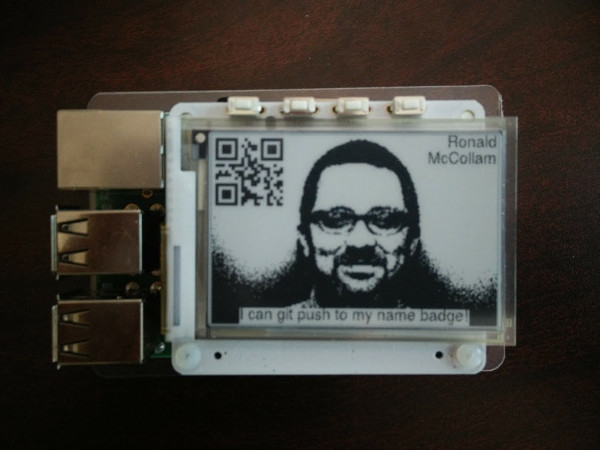
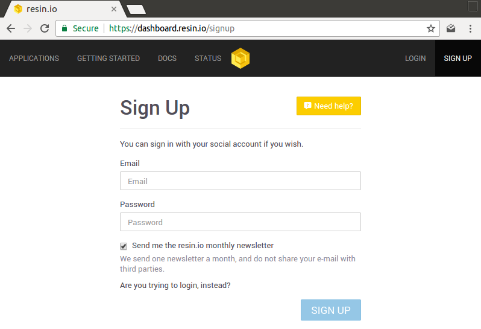
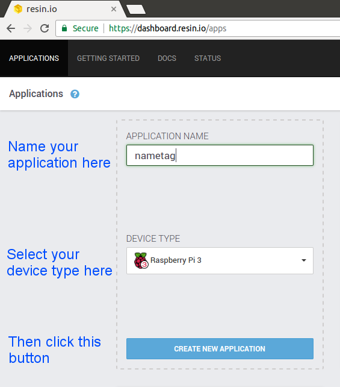
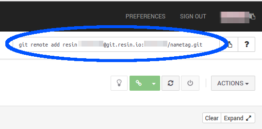

# resin-nametag
An epaper name tag for conferences that can be updated with resin.io

This project uses the [PaPiRus ePaper HAT](https://www.pi-supply.com/product/papirus-epaper-eink-screen-hat-for-raspberry-pi/) for the Raspberry Pi to serve as a name badge that can be updated and managed through resin.io.



## Use

1. Get a Raspberry Pi and PaPiRus HAT as described above.
2. Sign up for an account on [resin.io](https://resin.io).

  

3. Create an application for the version of the Raspberry Pi you are using.

  

4. Clone this repository:
    ```
    git clone https://github.com/resin-io-playground/resin-nametag

    cd resin-nametag
    ```  

5. Add your resin.io git URL to your local project by copying it from the upper right of the resin.io dashboard and pasting it into your terminal.

  

6. Make any changes you like to the `start.sh` script and replace `bw.png` with your own picture.
7. `git push resin master` and watch your name tag update!

8. You can modify what's displayed on the name tag using environment variables. Check out the [documentation on how to change environment variables in the resin.io dashboard](https://docs.resin.io/management/env-vars/):
 * `URL`: an URL to display as QR Code at the upper left corner
 * `STRING` string to display at the bottom of the nametag
 * `NAME`: string containing the name to display at the upper right corner. You can use the `\n` within the string to break it into multiple lines
